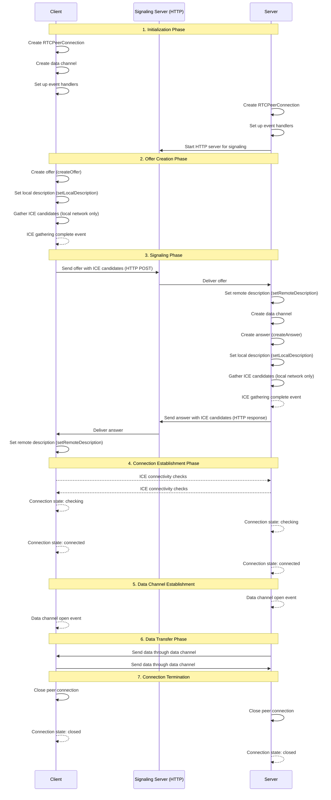

# WebRTC Connection Process Without STUN Servers

This document provides a detailed explanation of how WebRTC connections are established without using STUN servers, focusing on direct peer-to-peer connections within a local network.

## Introduction to WebRTC

WebRTC (Web Real-Time Communication) is an open-source project that provides web browsers and mobile applications with real-time communication capabilities via simple APIs. WebRTC allows audio, video, and data to be exchanged directly between peers, without requiring an intermediary server for the actual data transfer.

Key components of WebRTC include:

1. **MediaStream (getUserMedia)**: Captures audio and video
2. **RTCPeerConnection**: Establishes and maintains a connection between peers
3. **RTCDataChannel**: Enables bidirectional data transfer between peers

## WebRTC Connection Establishment Process

### Mermaid Sequence Diagram



## Detailed Technical Explanation

### 1. Initialization Phase

#### Client Side:
```
// Create a new SettingEngine
settingEngine := webrtc.SettingEngine{}

// Disable mDNS to prevent using multicast DNS candidates
settingEngine.SetICEMulticastDNSMode(ice.MulticastDNSModeDisabled)

// Allow all network interfaces for direct connection
settingEngine.SetInterfaceFilter(func(interfaceName string) bool {
    return true // Allow all interfaces
})

// Create a configuration with no STUN/TURN servers
config := webrtc.Configuration{
    ICEServers: []webrtc.ICEServer{}, // Empty ICE servers list
}

// Create a new API with the custom settings
api := webrtc.NewAPI(webrtc.WithSettingEngine(settingEngine))

// Create a new peer connection
peerConnection, err := api.NewPeerConnection(config)
```

#### Server Side:
Similar initialization to the client, but also starts an HTTP server to handle signaling:

```
// HTTP server for signaling
http.HandleFunc("/offer", func(w http.ResponseWriter, r *http.Request) {
    // Handle incoming offers
})

server := &http.Server{Addr: *addr}
go func() {
    if err := server.ListenAndServe(); err != nil && err != http.ErrServerClosed {
        logger.Error("HTTP server error: %v", err)
    }
}()
```

### 2. Offer Creation Phase

The client creates an offer, which is a Session Description Protocol (SDP) document containing:
- Media capabilities (codecs, formats)
- Transport information (IP addresses, ports)
- Security parameters (fingerprints for DTLS)

```
// Create a data channel first to ensure media section in SDP
dataChannel, err := peerConnection.CreateDataChannel("initChannel", nil)

// Create an offer
offer, err := peerConnection.CreateOffer(nil)

// Set the local description
if err := peerConnection.SetLocalDescription(offer); err != nil {
    // Handle error
}

// Wait for ICE gathering to complete
<-webrtc.GatheringCompletePromise(peerConnection)

// Get the local description after ICE gathering is complete
offer = *peerConnection.LocalDescription()
```

#### SDP Offer Example:
```
v=0
o=- 8664809619631715165 1750016061 IN IP4 0.0.0.0
s=-
t=0 0
a=msid-semantic:WMS*
a=fingerprint:sha-256 DD:40:52:02:47:56:49:A6:0F:DC:20:E2:40:5B:68:B2:03:CC:16:C8:95:13:76:D6:54:CF:11:3D:4C:CB:30:06
a=extmap-allow-mixed
a=group:BUNDLE 0
m=application 9 UDP/DTLS/SCTP webrtc-datachannel
c=IN IP4 0.0.0.0
a=setup:actpass
a=mid:0
a=sendrecv
a=sctp-port:5000
a=ice-ufrag:AUcreVsIDHWUjgOO
a=ice-pwd:NppBCEnynpRunklMNBBblLOlGbYIHpUt
a=candidate:4068344835 1 udp 2130706431 192.168.1.227 47828 typ host
a=candidate:233762139 1 udp 2130706431 172.17.0.1 50536 typ host
a=end-of-candidates
```

Key components in the SDP:
- **ice-ufrag/ice-pwd**: Credentials for ICE connectivity checks
- **fingerprint**: DTLS certificate fingerprint for secure connection
- **candidate**: Local network ICE candidates (only host candidates, no STUN/TURN)
- **setup:actpass**: Indicates this peer can act as either client or server in DTLS negotiation

### 3. Signaling Phase

The client sends the offer to the server through the signaling server (HTTP in this case):

```
// Send the offer to the server
offerJSON, err := json.Marshal(offer)
resp, err := http.Post(*serverURL, "application/json", strings.NewReader(string(offerJSON)))
```

The server processes the offer:

```
// Parse the offer from the request
var offer webrtc.SessionDescription
if err := json.NewDecoder(r.Body).Decode(&offer); err != nil {
    // Handle error
}

// Set the remote description
if err := peerConnection.SetRemoteDescription(offer); err != nil {
    // Handle error
}

// Create a data channel
dataChannel, err := peerConnection.CreateDataChannel("fileStream", nil)

// Create an answer
answer, err := peerConnection.CreateAnswer(nil)

// Set the local description
if err := peerConnection.SetLocalDescription(answer); err != nil {
    // Handle error
}

// Wait for ICE gathering to complete
<-webrtc.GatheringCompletePromise(peerConnection)

// Get the local description after ICE gathering is complete
answer = *peerConnection.LocalDescription()

// Return the answer
w.Header().Set("Content-Type", "application/json")
json.NewEncoder(w).Encode(answer)
```

The client receives and processes the answer:

```
// Read the answer
answerJSON, err := io.ReadAll(resp.Body)

// Parse the answer
var answer webrtc.SessionDescription
if err := json.Unmarshal(answerJSON, &answer); err != nil {
    // Handle error
}

// Set the remote description
if err := peerConnection.SetRemoteDescription(answer); err != nil {
    // Handle error
}
```

### 4. Connection Establishment Phase

After the exchange of SDP offers and answers, both peers have the necessary information to establish a direct connection:

1. **ICE Connectivity Checks**: Both peers use the ICE framework to find the best path for communication:
   - They exchange ICE candidates (in our case, only local network candidates)
   - They perform connectivity checks using STUN binding requests
   - They select the best candidate pair for communication

2. **DTLS Handshake**: Once ICE connectivity is established, a DTLS (Datagram Transport Layer Security) handshake occurs:
   - The peers verify each other's identity using the fingerprints exchanged in the SDP
   - They establish encryption keys for secure communication
   - This provides security similar to TLS in HTTPS

3. **SCTP Association**: After the DTLS handshake, an SCTP (Stream Control Transmission Protocol) association is established:
   - This provides the transport for data channels
   - It supports multiple streams, reliable/unreliable delivery, and flow control

### 5. Data Channel Establishment

Once the SCTP association is established, the data channels become operational:

```
// Server side
dataChannel.OnOpen(func() {
    logger.Info("Data channel opened")
    // Start sending data
})

// Client side
peerConnection.OnDataChannel(func(d *webrtc.DataChannel) {
    d.OnOpen(func() {
        logger.Info("Data channel opened")
    })

    d.OnMessage(func(msg webrtc.DataChannelMessage) {
        // Process received data
    })
})
```

### 6. Data Transfer Phase

Data can now be exchanged directly between peers:

```
// Sending data
if err := dataChannel.SendText(data); err != nil {
    // Handle error
}

// Receiving data is handled in the OnMessage callback
```

### 7. Connection Termination

When the communication is complete, the connection can be closed:

```
// Close the peer connection
if err := peerConnection.Close(); err != nil {
    // Handle error
}
```

## Key Differences When Not Using STUN Servers

When establishing WebRTC connections without STUN servers:

1. **ICE Candidate Gathering**: Only local network (host) candidates are gathered, no server-reflexive candidates from STUN servers.

2. **Network Address Translation (NAT) Traversal**: Without STUN, peers must be on the same network or have direct connectivity (e.g., through port forwarding).

3. **Configuration**: The WebRTC configuration must be modified:
   ```
   // Empty ICE servers list - no STUN/TURN
   config := webrtc.Configuration{
       ICEServers: []webrtc.ICEServer{},
   }
   ```

4. **Connection Reliability**: Connections are more reliable within a local network but won't work across different NATs without additional configuration.

5. **Privacy**: No external servers are involved in the connection process, providing better privacy.

## Conclusion

Establishing WebRTC connections without STUN servers is possible and beneficial in controlled environments like local networks. It provides enhanced privacy and can be more efficient since it eliminates the need for external servers during the connection process.

However, this approach has limitations for connections across different networks, especially when NAT traversal is required. In such cases, STUN and potentially TURN servers become necessary to establish reliable connections.

The implementation in this project demonstrates a successful approach to direct WebRTC connections within a local network, showcasing the core WebRTC technologies while maintaining privacy by avoiding external STUN servers.
